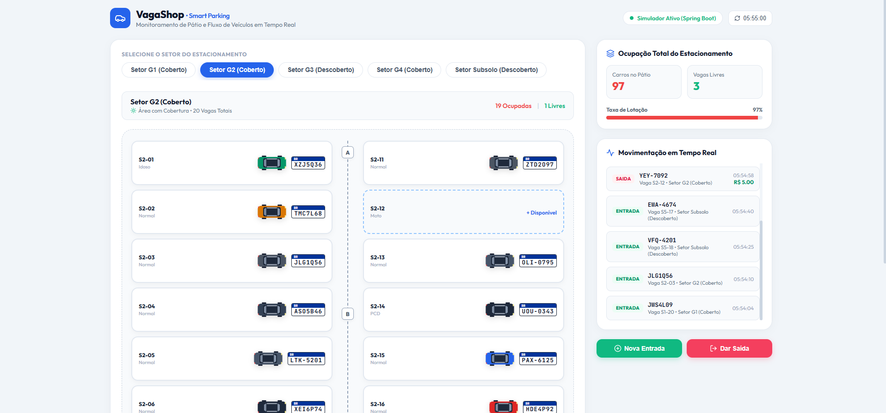
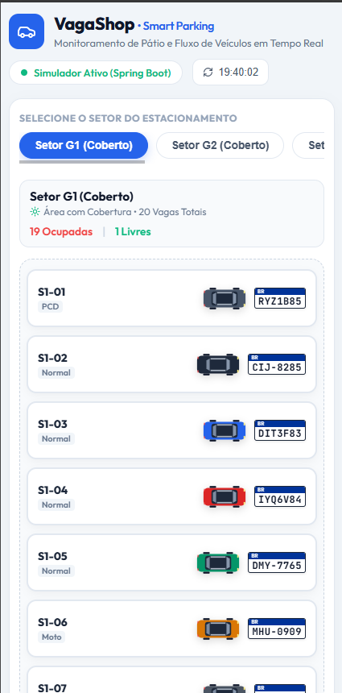

<div align="center">

# VagaShop - Sistema Inteligente de Gestão de Estacionamento

Um sistema moderno e completo de monitoramento e controle de fluxo de estacionamento em tempo real, construído com **Java Spring Boot 3**, **React**, **PostgreSQL** e orquestrado com **Docker**.


</div>

---

## Demonstração Visual

<div align="center">
  <h3>Versão Desktop</h3>
  
  <br/><br/>
  <h3>Versão Mobile (Responsivo)</h3>
  
</div>

---

## Sobre o Projeto

O **VagaShop** é uma plataforma desenvolvida para controlar a ocupação de vagas de um estacionamento com 5 setores (3 cobertos e 2 descobertos) totalizando 100 vagas divididas por categorias (*Normal, PCD, Idoso e Moto*).

O backend inclui um **simulador autônomo de fluxo** que registra entradas e saídas contínuas diretamente no banco de dados, além de permitir o registro manual de check-in e check-out com cálculo tarifário em tempo real.

---

## Principais Funcionalidades

- **Dashboard em Tempo Real**: Métricas atualizadas automaticamente (Total de Vagas, Vagas Ocupadas, Vagas Livres e Taxa de Lotação).
- **Mapa Interativo de Vagas**: Visualização setorizada das 100 vagas com identificação imediata de status (*Livre* vs *Ocupada* com veículo top-view e placa Mercosul/tradicional).
- **Interface Responsiva**: Experiência fluida tanto em computadores quanto em dispositivos móveis, com layout ajustável em coluna única no mobile.
- **Regras de Negócio e Tarifação**: Cálculo automático do valor de permanência (R$ 5,00/hora cheia) na saída do veículo.
- **Validação de Placas**: Validação com *Bean Validation* nos formatos padrão Mercosul (`AAA1A23`) e Tradicional (`AAA-1234`).
- **Simulação Contínua**: Motor agendado (`@Scheduled`) no Spring Boot que gera movimentação contínua de pátio para demonstração e análise de dados.

---

## Arquitetura e Tecnologias

### Backend (Java Spring Boot)
- **Spring Data JPA & Hibernate**: Modelagem relacional e queries otimizadas com paginação.
- **Camada MVC / REST**: Separação clara entre *Controllers*, *Services*, *Repositories*, *DTOs* e *Mappers*.
- **Bean Validation**: Validação estrita de entradas com tratamento global de erros (`@RestControllerAdvice`).
- **Enums e Constantes**: Tipagem forte para eventos e categorias de vagas.

### Frontend (React + Vite)
- **React 18**: Componentização limpa com React Hooks e consumo da API REST.
- **Vanilla CSS Moderno**: Layout arquitetural limpo, responsivo com suporte completo a dispositivos móveis.
- **Lucide Icons**: Ícones modernos e intuitivos.

### Banco de Dados & Infraestrutura
- **PostgreSQL 16**: Banco de dados relacional com integridade referencial.
- **Docker & Docker Compose**: Subida de todo o ecossistema com um único comando.

---

## Como Executar o Projeto

### Pré-requisitos
- [Docker Desktop](https://www.docker.com/products/docker-desktop/) instalado e em execução.
- [Git](https://git-scm.com/) instalado.

### 1. Clonar o Repositório
```bash
git clone https://github.com/Fillipython/VagaShop.git
cd VagaShop
```

### 2. Iniciar Todos os Serviços via Docker
```bash
docker compose up -d --build
```

---

## Endereços de Acesso

| Serviço | URL | Descrição |
| :--- | :--- | :--- |
| **Frontend Dashboard** | `http://localhost:3000` | Interface visual do usuário em tempo real |
| **Backend API** | `http://localhost:8080/api/dashboard/live` | Endpoint REST do Spring Boot |
| **Adminer (Database UI)** | `http://localhost:8888` | Gerenciador web do banco de dados PostgreSQL |

---

## Estrutura do Repositório

```
VagaShop/
├── backend/                  # API Java Spring Boot 3
│   ├── src/main/java/com/vagashop/
│   │   ├── domain/entity/    # Entidades JPA (Setor, Vaga, Veiculo, Registro)
│   │   ├── domain/enums/     # Enums (TipoEvento, TipoVaga)
│   │   ├── dto/              # DTOs de Request e Response
│   │   ├── mapper/           # Mappers toDTO e toEntity
│   │   ├── service/          # Regras de negócio e Simulador
│   │   ├── controller/       # Endpoints REST
│   │   └── exception/        # Tratamento global de exceções
│   └── Dockerfile            # Multi-stage build Maven + Java 17
├── frontend/                 # Interface React + Vite
│   ├── src/                  # Componentes e estilos
│   └── Dockerfile            # Container Node.js
├── schema.sql                # Script de inicialização do PostgreSQL
├── docker-compose.yml        # Orquestração dos containers
├── vagas-ocupadas.png        # Print da visualização Desktop
├── vagas-ocupadas-mobile.png # Print da visualização Mobile
└── README.md                 # Documentação do projeto
```

---

## Autor

Desenvolvido por **[Fillipython](https://github.com/Fillipython)**.
